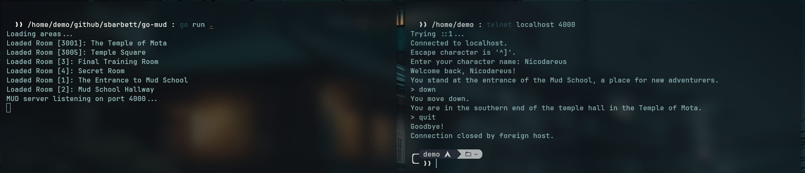

# go-mud

**go-mud** is an attempt to create a simple MUD (Multi-User Dungeon) server in Go, inspired by the stock **ROM 2.4** codebase I remember from my childhood. This is my first attempt at a Go project.

## Features
- Basic telnet-based multiplayer interaction
- Persistent character creation and storage
- Room-based movement and descriptions
- Area loading from YAML files
- Simple command handling

## Running the Server
To run the MUD server locally:
```sh
go run .
```
Or, with Docker:
```sh
docker compose up --build
```

## Example



## Why?
I wanted to recreate the experience of old-school MUDs while learning Go at the same time. This project is primarily for **fun and nostalgia**—but if it turns into something functional, cool.

## License

[MIT](LICENSE}
